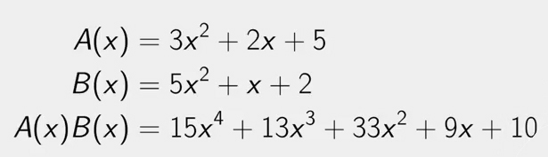
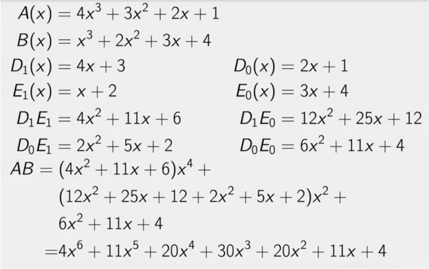
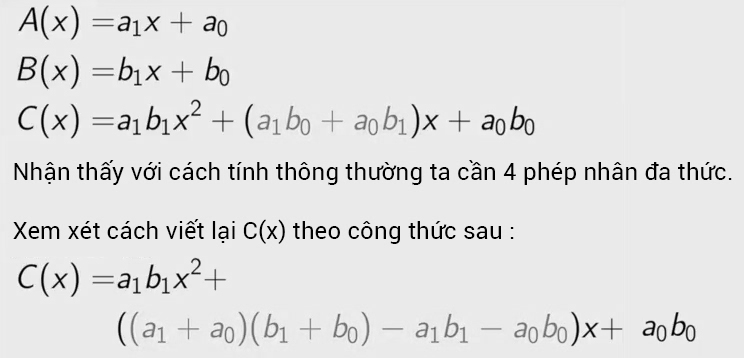
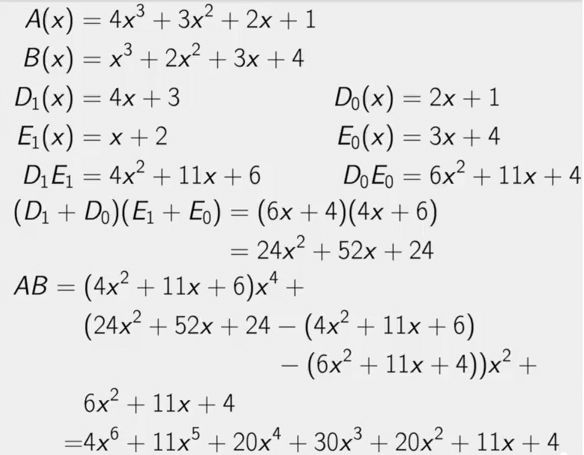

# Đệ quy - Chia để trị
## 1. Tìm kiếm tuyến tính bằng phép đệ quy.
### 1.1 Problem
> Cho một mảng __A__ gồm __N__ phần tử và một số nguyên K.
Trả về _i_ mà __A[i] = K__. Nếu không tìm thấy trả về __NOT_FOUND__.

| INPUT | OUTPUT |
|-------|:--------:|
|5 2 | |
|3 1 2 4 6|3|


```
LinearSearch(A, low, high, K){
    if (high < low) return NOT_FOUND
    if A[low] = key
      return low
    return LinearSearch(A, low + 1, high, K)
}
```

## 2. Tìm kiếm nhị phân.
### 2.1 Problem
> Cho một mảng A đã sắp xếp gồm N phần tử và một số nguyên K. Trả về i mà A[i] = K.
Nếu không tìm thấy trả về giá trị i lớn nhất mà A[i] < K. Ngược lại nếu (k < A[low]), kết quả là (low - 1).

### 2.2 Ví dụ
> Cho mảng A[] = [3, 5, 8, 20, 30, 50, 60]

|Query| Result|
|-----|-------|
|`search(2)`|0|
|`search(3)`|1|
|`search(4)`|1|
|`search(20)`|4|

```
BinarySearch(A, low, high, K){
  if (high < low) return (low - 1)

  mid = low + (high - low)/2
  if key = A[mid] return (mid)

  else if key < A[mid]
    return BinarySearch(A, low, mid - 1, K)

  else return BinarySearch(A, mid + 1, high, K)

}
```


## 3. Nhân 2 đa thức cùng bậc
### 3.1 Problem
> Cho N và 2 đa thức A(x), B(x) cùng bậc N-1. In ra C(x) là kết quả khi nhân 2 đa thức trên.

### 3.2 Ví dụ

|INPUT|OUTPUT|
|-----|------|
|3||
|3 2 5| 15  13  33  9  10|
|5 1 2| .|



### 3.3 Cách giải đơn giản
```
product[2n-1]

for i:=0 -> 2n-2
  product[i] = 0

for i:=0 -> n-1
  for j:=o -> n-1
    product[i + j] = product[i + j] + A[i]*B[j]

```
__ Độ phức tạp : __ O(n^2)


### 3.4 Cách giải đơn giản kết hợp đệ quy

```
Function Mult2(A, B, n, a1, b1){
  R = array[0..2n-1]
  if n = 1 :
    R[0] = A[a1]*B[b1]; return R

  R[0..n-2] = Mult2(A, B, n/2, a1, b1)

  R[n..2n-2] = Mult2(A, B, n/2, a1 + n/2, b1 + n/2)

  D0E1 = Mult2(A, B, n/2, a1, b1 + n/2)

  D1E0 = Mult2(A, B, n/2, a1 + n/2, b1)

  R[n/2 ... n + n/2 - 2] += D1E0 + D0E1

  return R
}

```


__ Độ phức tạp : __ O(n^2)

### 3.5 Cách giải cải tiến kết hợp đệ quy và chia để trị.


> Dễ dàng nhận thấy cách này giảm bớt độ phức tạp của chương trình đi. Điều này hoàn toàn có thể chứng minh được bằng toán học. Việc chứng minh xin nhường lại cho các bạn.



__ Độ phức tạp : __ O(n^1.58)

## 4. Tài liệu tham khảo
* Coursera
* Sanjoy Dasgupta, Christos Papadimitriou, and Umesh Vazirani. Algorithms (1st Edition). McGraw-Hill Higher Education. 2008.
